# Reference: the catalog resolution workflow

This note traces what `resolve_catalog` / `resolve_bundle` (`src/router/catalog.py`)
actually do, in order — which sources are consulted, what is decided deterministically,
when an LLM reader is invoked, and how the result is graded. The module docstring states
the *principle* (a missing-context problem, fixed by importing context into the catalog
before routing); this note states the *sequence*, so the ordering invariants are legible
without reading 1200 lines.

The layer sits between the context layer and the field router: it turns each opaque
column into a *described* column so the router's search can reach it. See
[routing buckets](routing-buckets.md) for what the router then does with the result, and
[the field-router plan](../plans/field-router.md) for the surrounding design.

## At a glance

Blue parallelograms are **data**, white rectangles are **steps**, yellow diamonds are
**decisions**. Each step names the phase below that describes it.

```mermaid
flowchart TD
    bundle[/"Bundle: data tables + other files"/]:::data

    %% Phase 0 — sort the other files
    bundle --> sort["Phase 0 · Sort the other files"]:::step
    sort --> isCodebook{"Table whose values<br/>are column names?"}:::decision
    isCodebook -->|yes| codebooks[/"Codebook tables"/]:::data
    sort --> documents[/"Documents"/]:::data
    documents --> isGlossary{"3+ term = definition lines<br/>on column names?"}:::decision
    isGlossary -->|yes| glossaries[/"Glossary entries"/]:::data

    %% Phase 1 — deterministic candidates
    bundle --> tables[/"Data tables"/]:::data
    tables --> profile["Phase 1 · Profile each column<br/>sample of up to 1000 rows"]:::step
    profile --> profiles[/"Column profiles<br/>type, range, whole numbers, distinct values"/]:::data
    profiles --> collect["Phase 1 · Collect candidate meanings"]:::step
    codebooks --> collect
    glossaries --> collect
    collect --> candidates[/"Candidates<br/>codebook row: high · glossary: medium<br/>value prior: coordinates, dates"/]:::data
    candidates --> anyCandidate{"Column has<br/>a candidate?"}:::decision
    anyCandidate -->|no| unexplained[/"Unexplained columns<br/>all tables, deduplicated"/]:::data

    %% Phase 2 — the reader, unexplained columns only
    unexplained --> readerOn{"LLM reader on?"}:::decision
    readerOn -->|yes| split["Phase 2 · Split each document into passages<br/>up to 20,000 chars"]:::step
    documents --> split
    split --> passages[/"Passages"/]:::data
    passages --> fewPassages{"Document fits<br/>in 1 passage?"}:::decision
    fewPassages -->|yes| readAll["Phase 2 · Read the whole document<br/>for all unexplained columns<br/>1 call"]:::step
    fewPassages -->|no| bm25["Phase 2 · BM25: top 3 chunks per column,<br/>packed into passages up to 20,000 chars<br/>1 call per passage"]:::step
    readAll --> reads[/"Reads<br/>description, units, quote"/]:::data
    bm25 --> reads
    reads --> ground["Phase 2 · Find each quote in the document"]:::step
    ground --> readCandidates[/"Read candidates<br/>found: citation + grade<br/>not found: low + flagged"/]:::data

    %% Phase 3 — compare claims, decide each column
    anyCandidate -->|yes| compare["Phase 3 · Group each column's claims by meaning<br/>claim comparer: 1 LLM call, or same wording"]:::step
    readCandidates --> compare
    compare --> groups[/"Claim groups"/]:::data
    groups --> decide["Phase 3 · Decide each column<br/>strongest source · values refute · found quote wins"]:::step
    readerOn -->|no| decide
    decide --> resolved[/"Resolved columns<br/>meaning, units, confidence,<br/>corroborated by, conflicts, alternatives"/]:::data
    decide --> unresolved[/"Unresolved columns"/]:::data

    %% Phase 4 — assemble
    resolved --> assemble["Phase 4 · Assemble one catalog for all tables"]:::step
    unresolved --> assemble
    assemble --> catalog[/"Catalog + the bundle files it came from<br/>→ field router"/]:::data

    classDef data fill:#e3f0ff,stroke:#3a6ea5,color:#0b2545
    classDef step fill:#ffffff,stroke:#444444,color:#111111
    classDef decision fill:#fff4dc,stroke:#b7791f,color:#3d2a00
```

The numbers in the diagram are defaults (see below).

## Entry points

| Function | Scope |
|---|---|
| `resolve_catalog(target, resource, sources, prose_reader, claim_comparer)` | one data table |
| `resolve_bundle(targets, sources, prose_reader, claim_comparer)` | many tables → **one** catalog spanning all their columns |

Both take the same auxiliary `sources` (the rest of the bundle), an optional
`prose_reader`, and an optional `claim_comparer`. `resolve_bundle` is the real-repository case: the fields of one schema
are answered by columns in *different* tables, so every `ResolvedColumn` keeps its
`resource` and the router ranks a field against all tables at once.

The numbers below are defaults. Every one is a field of `Thresholds` in
`src/thresholds.py`, overridable with `THRESHOLD_<NAME>` in `.env` or from the app's
settings panel.

## Phase 0 — classify the bundle's sources

Each auxiliary source is auto-classified; nothing depends on a filename convention.

- A **`TabularContext`** is tested by `_as_dictionary`: find the column whose *values
  are the target's column names*, ranked by match count then purity, and accept it only
  if precision ≥ `catalog_dictionary_key_precision` (0.5) and uniqueness ≥
  `catalog_dictionary_key_uniqueness` (0.9). Precision lets a *partial* codebook through;
  uniqueness is what stops a row-scale observation table — repeated values — from being
  read as a codebook. Description / units / notes columns are then picked by name regex,
  yielding a `by_name` map. (`looks_like_dictionary` exposes this same test to a caller
  partitioning a bundle.)
- A **`TextContext`** is kept as a document for the reader, and each of its files is
  tested by `_as_text_codebook` for the same thing written as text: a glossary. Every
  `term <sep> definition` entry is parsed (`:` / `=`, or a dash with whitespace on both
  sides), and adjacent well-formed entries are grouped into runs. A run is accepted only if
  it has at least `catalog_text_codebook_min_entries` (3) entries and `catalog_dictionary_key_precision`
  of its terms are schema names — the table's precision rule. **A separator alone is never
  the signal**: `AAS = MO2max − MO2standard` in a Methods paragraph has the same `=` as
  `la = latitude`. An entry must also be shaped like a definition (`_is_definition`:
  balanced brackets, no arithmetic, no stray spaced dash, no dangling function word), and a
  malformed entry ends its run. An entry whose definition only restates its term
  (`p50 – p50`) is well-formed, so it keeps its run intact, but it is not recorded: the
  column stays unresolved and open to the reader. Trailing parenthesised units are split off. Isolated
  matches are dropped — they are narrative, and narrative is the reader's.

**The vocabulary the codebook tests are judged against matters.** `resolve_catalog` uses
that one table's columns; `resolve_bundle` passes *the whole bundle's* column names. Without
that, a bundle-wide codebook is mostly *other* tables' names from any single table's point of
view and falls under the precision floor — so one shared codebook would be recognised nowhere.

## Phase 1 — deterministic candidates, per table

`_gather_table`, no LLM involved. It reads a **sample** of the table
(`catalog_profile_sample` = 1000 rows — approximate stats are enough for a prior and for the
refutation cross-check, and this keeps cost following the schema and the docs, not the
row count), then for each column computes a value profile (`_value_profile`) and
gathers its candidates (`_deterministic_candidates`). The profile also counts each
column's distinct values and lists them when there are at most
`catalog_distinct_values_max` (5); they resolve nothing, but ride on the resolved column
so the router's column matcher can see that a column holding one value *is* that value.
**Nothing is chosen yet**: every column is decided once, at the end (Phase 3), after the
reader has added what it reads.
Three assurance tiers, ranked by `_TIER_RANK`:

| Tier | Rank | Source |
|---|---|---|
| `structured_dictionary` | 3 | a codebook row keyed on the column name (matched via `_read_key`, trimmed and case-folded, so a stray-space header like `'Nitrate '` still finds its row); base confidence `high` |
| `text_codebook` | 2 | an entry of an accepted glossary run, cited as a `resource#start-end` span; base confidence `medium`. Ranked below a table because a parse of text can split an entry wrongly where a cell cannot — the table wins a disagreement, and the text can only corroborate it |
| `value_prior` | 1 | only the `_SELF_EVIDENT` labels — coordinates, parseable dates. Values genuinely identify nothing else: "numeric, [0.3, 8.7]" names neither pH nor biomass. The coordinate prior additionally requires the *name* to corroborate (`_looks_like_coordinate_name`), turning a guess into a name-plus-value agreement. |

A column this leaves with **no candidates at all** is a *residual*: nothing describes it
and its values cannot name it. It is what gates the next phase.

## Phase 2 — the reader pass, on residuals only

`_read_residuals`, skipped entirely when no `prose_reader` was supplied.

**Residual gating.** Only columns Phase 1 left without a candidate are read, which
keeps an expensive reader off every column a codebook, table or text, already resolved.

**Bundle-level hoist.** Residual columns from *all* tables are unioned into a single pass,
deduped on `_read_key` (trimmed **and** case-folded) — a prose read depends on the name and
the docs, not the table, so `ID` and `id` in two tables are one read, and a document is read
once for the whole bundle.

**The path is chosen per document by its passage count.** Each document is split into
contiguous passages of up to `catalog_passage_max_chars` (20 000); the field router's
passage reader applies the same rule.

- **At most `catalog_read_all_max_passages` (1) passages → `_read_all`: no retrieval at
  all.** Every passage goes to the reader with *all* residual columns, one `read_many` per
  passage; a README is one passage, so one call. This is deliberate, not a shortcut:
  retrieval by column token fails on narrative that never uses the literal name ("oxygen
  debt" for `EPOC`). The default is 1 rather than the router's 10: measured on
  `readme_long` (2 passages), reading both passages for every column added no coverage and
  made the reader invent units for columns a passage never describes.
- **More → `_localized_reads`**, today a pass-through to `_batch_prose_reads`:
  BM25 over every chunk of every document by the column token, top `catalog_prose_read_k` (3)
  chunks per column. The distinct retrieved chunks are then **packed** in document order
  into passages of up to `catalog_passage_max_chars` (20 000), and each passage is read once over
  every column that retrieved a chunk in it — an expensive backend pays per retrieved
  text, not per chunk or column. Each read is grounded in the chunk its quote is found in,
  so citations stay document offsets. A column whose name is opaque or stopword-only
  (`la`) retrieves nothing and is skipped. A stronger localizer (embedding retrieval with
  the query expanded by dtype and value profile, heading-aware section preference) is
  deferred and marked `TODO(long-doc)`; the token retriever is the honest, limited stand-in.

**Every read is then grounded** by `_ground_read`. The LLM *proposes* a verbatim quote;
locating it *disposes* of it — exact match, then case-insensitive, then whitespace-tolerant
(`locate_quote`, shared with the router's citation grounding), so only a genuine
paraphrase misses. A located quote yields a real span
citation (`resource#start-end`), the text as found in the document, and a grade from
`_grounding_grade` (`high` when the quote both mentions the column and carries the
description's content words, else `medium`). A quote that cannot be located yields the
coarse citation, `low` confidence, and a recorded conflict: the read may still be right, but
its evidence is unconfirmed.

When a column has several reads, `_decide` (Phase 3) keeps that grade from being
overridden: a read whose quote was found is chosen over one whose quote was not; a chosen
unconfirmed read stays `low` even if other reads disagree or repeat it; and an unconfirmed
read never counts as corroboration. Reads are fanned back out on `_read_key`, so a single
read reaches every spelling of the column across the bundle.

## Phase 3 — compare claims, then decide

**Comparing claims.** `_compare_claims` groups each column's candidates by the meaning they
state, in one pass over the bundle. Only a column whose candidates differ in wording (case
and spacing aside) is compared; a column name that recurs across tables with the same
claims is compared once. The `ClaimComparer` decides the groups: the default groups on
identical wording, so "fish mass" and "the mass of the fish" disagree; `LLMClaimComparer`
sends every such column in **one** call, each claim with its description, units and source
text, and asks for a partition into same-meaning groups (same quantity, same or equivalent
units; related, broader or narrower is different; when unsure, apart). A failed call, or an
answer for a column that is not a partition of its claims, falls back to identical wording
for that column — in doubt, claims disagree rather than corroborate. The comparer only
groups; it never chooses.

`_decide` then adjudicates each column:

1. keep only the **highest tier present**;
2. **the value profile referees** — drop any candidate `_cross_check` refutes; then a read
   whose quote was found beats one whose was not; source order breaks a remaining tie;
3. record agreement from *any* source, any tier, as `corroborated_by` — a candidate in the
   chosen claim's group, unless its evidence is unconfirmed or it is a read quoting the
   same sentence as the chosen read (a copy, not a second source); a pool spanning more
   than one group as `conflicts`; every loser as `alternatives`;
4. grade confidence — refuted, or the chosen read's evidence unconfirmed → `low`; values
   adjudicated a same-tier conflict, or differing claims left unadjudicated → `medium`;
   corroborated → `high`; otherwise the chosen source's own tier base.

With **no candidates at all** the column **abstains** (`link_method="none"`, description
left empty). This is a first-class outcome, not a failure path: a fabricated label is worse
than an honest gap.

`prose_read` shares rank 2 with `text_codebook`, but under residual gating the two never
compete for one column: a read only reaches a column no codebook answered. The rank only
places a read above the value prior.

## Phase 4 — assemble, and what the router sees

Every table's columns are concatenated into one `Catalog`. Each `ResolvedColumn` carries its
`resource`, so the router ranks a field against every table's columns at once and the compiler
groups extraction by table; a name occurring in two tables is disambiguated with
`Catalog.find(name, resource)` rather than `get(name)`.

`Catalog.search(query, k)` is the payoff: the same BM25 ranking as `TabularContext.search`,
but over each column's **enriched** `document()` text rather than its bare header — so a query
for "latitude" now reaches column `la` through its resolved description, closing the semantic
gap that motivated the layer. `Catalog.conflicts` surfaces every column's unresolved
disagreements for reporting.

## Ordering invariants

Three, worth stating separately because they are what the design buys:

1. **Deterministic tiers run before the reader.** Residual gating is what keeps the LLM off
   columns a codebook already answered — cost follows the *unexplained* columns.
2. **Candidates are fully gathered before anything is chosen.** Nothing is decided by list
   position except an explicit same-tier tiebreak; the tier ranking and the value profile do
   the deciding.
3. **The value profile is a referee, not a guesser.** It refutes and corroborates claims from
   the other tiers everywhere, but it *proposes* only for the few self-evident kinds.

## In one paragraph

Catalog resolution classifies the bundle's other resources into codebooks (recognised
structurally — a table column, or a run of glossary entries, whose keys are the schema's names)
and documents; gathers each table's candidates from three deterministic assurance tiers —
codebook table, text codebook (a glossary run accepted on its structure, not its
separators), self-evident value prior; then, only for the columns left without any and only
once for the whole bundle, invokes an optional prose reader, handing it every passage of a
document with few enough passages and BM25-localized chunks packed into passages otherwise,
grounding every read against its own verbatim quote; groups every column's differing claims
by meaning with a claim comparer (one LLM call for the bundle, or identical wording without
one); decides each column once — top tier, value profile as referee, recording
corroboration, conflicts and losing alternatives, abstaining where nothing describes it; and
finally concatenates every table's resolved columns into one catalog whose enriched
per-column documents are what the field router actually searches.
